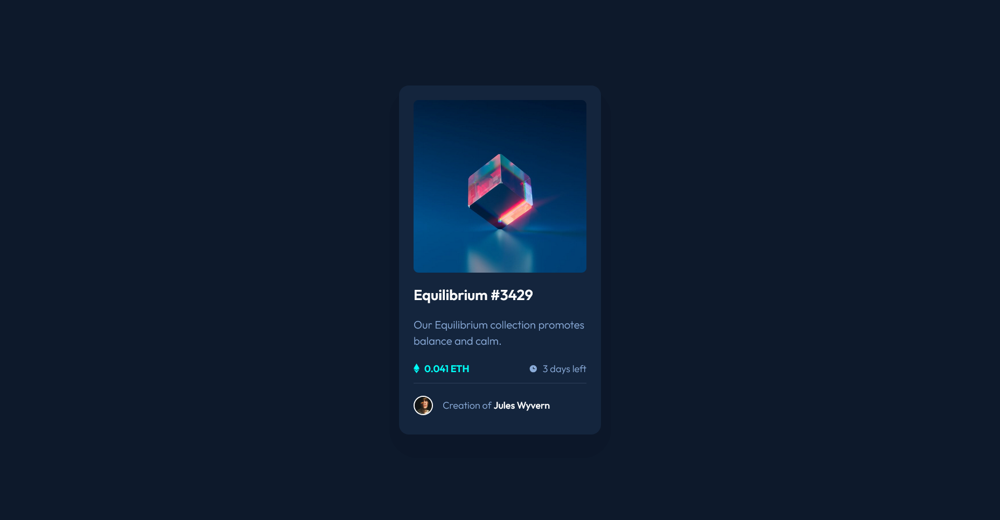
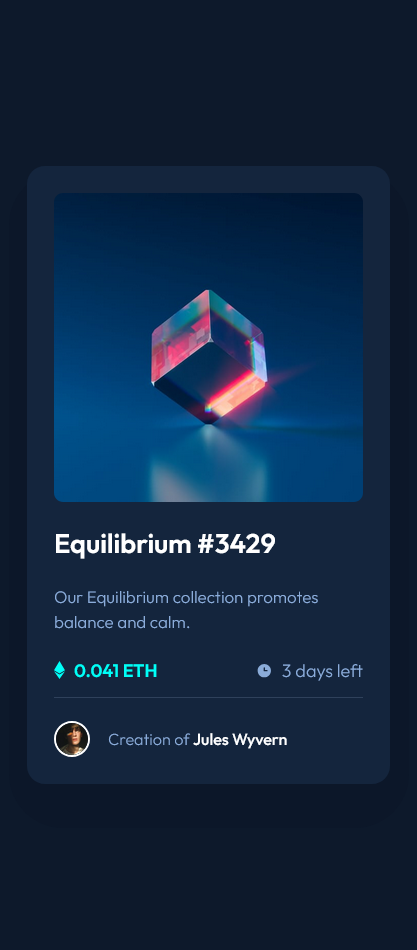

# Frontend Mentor - NFT preview card component solution

This is a solution to the [NFT preview card component challenge on Frontend Mentor](https://www.frontendmentor.io/challenges/nft-preview-card-component-SbdUL_w0U). Frontend Mentor challenges help you improve your coding skills by building realistic projects. 

## Table of contents

- [Overview](#overview)
  - [The challenge](#the-challenge)
  - [Screenshot](#screenshot)
  - [Links](#links)
- [My process](#my-process)
  - [Built with](#built-with)
  - [What I learned](#what-i-learned)
- [Author](#author)

## Overview

### The challenge

Users should be able to:

- View the optimal layout depending on their device's screen size
- See hover states for interactive elements

### Screenshot

#### Desktop



#### Mobile



### Links

- Solution URL: [https://github.com/Akiz-Ivanov/interactive-rating-component](https://github.com/Akiz-Ivanov/nft-preview-card)
- Live Site URL: [https://akiz-ivanov.github.io/interactive-rating-component/](https://akiz-ivanov.github.io/nft-preview-card/)

## My process

### Built with

- Semantic HTML5 markup
- Mobile-first workflow
- Tailwind CSS
- Flexbox

### What I learned

I learned how to create a realistic shadow effect using an absolutely positioned div behind the main card component. This technique gives the card a nice depth effect:

```html
<main class="relative">
    <div class="absolute inset-0 rounded-[3rem] bg-[#0c1729] -z-10 translate-y-7
    left-1/2 right-1/2 w-[96%] h-[98%] transform -translate-x-1/2"></div>
    
    <div class="card flex flex-col justify-center items-baseline gap-5
      bg-blue-900 text-blue-500 font-light text-body
      m-6 p-6 rounded-2xl max-w-[375px] sm:pb-8">
    </div>
</main>
```

## Author

- Frontend Mentor - [@Akiz97](https://www.frontendmentor.io/profile/Akiz97)